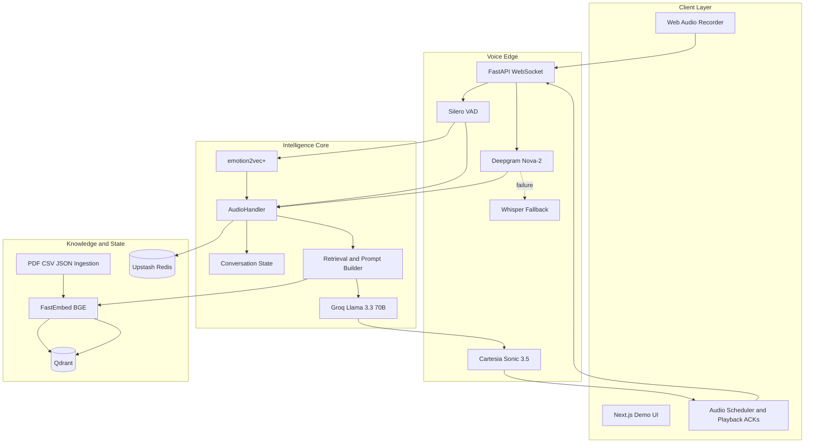
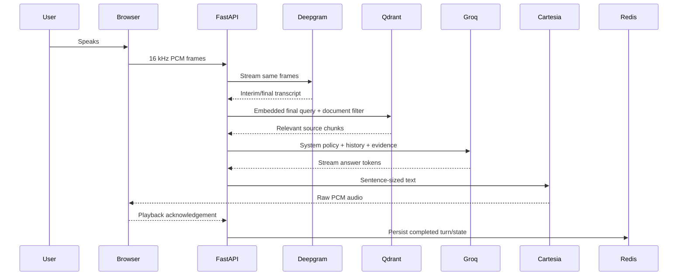
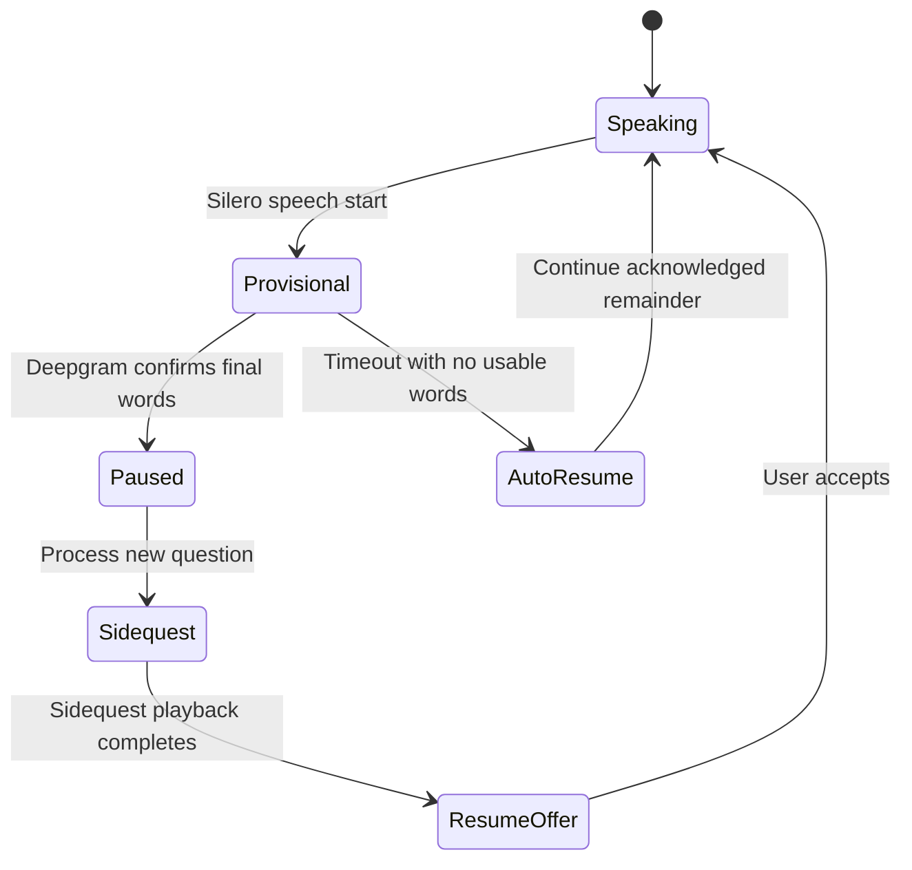
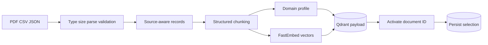

# Via Demo and Architecture Handbook

> [!abstract] One-line definition
> **Via is an interruption-aware universal voice mentor that changes its
> professional perspective according to relevant uploaded knowledge, responds
> to the user's emotional delivery, and preserves conversational memory.**

## Table of contents

1. [[#Executive brief]]
2. [[#What Via can do]]
3. [[#Architecture at a glance]]
4. [[#Why the architecture evolved]]
5. [[#Universal domain behavior]]
6. [[#Component encyclopedia]]
7. [[#End-to-end workflows]]
8. [[#Data and state ownership]]
9. [[#API and WebSocket reference]]
10. [[#Reliability and safety]]
11. [[#Implemented versus future work]]
12. [[#Running and testing]]
13. [[#Hackathon demonstration script]]
14. [[#Likely judge questions]]
15. [[#Glossary]]

---

## Executive brief

### What the name means

**Via** stands for **Adaptive Universal Resilient Agent**.

- **Adaptive:** It changes response detail, tone, pacing, and clarification
  behavior based on the user's request and emotional signals.
- **Universal:** Its core is domain-neutral. PDF, CSV, or JSON knowledge can
  turn the current response into a real-estate, insurance, banking, product,
  or education interaction without rebuilding the agent.
- **Resilient:** It can be interrupted, answer a side question, remember the
  unfinished response, and return to it. Provider failures degrade visibly
  instead of silently breaking the session.
- **Agent:** It coordinates perception, knowledge retrieval, reasoning, voice
  generation, memory, and real-time state rather than being a single model.

### The problem Via solves

Most voice assistants have four weaknesses:

1. They feel unnatural because users must wait for strict turn boundaries.
2. An interruption causes them to forget the original explanation.
3. They answer from a fixed domain or hallucinate beyond supplied material.
4. They treat every sentence identically even when the user sounds stressed or
   explicitly confused.

Via separates voice transport, conversational state, knowledge, reasoning,
emotional interpretation, and persistence so each problem has an explicit
owner.

### Thirty-second pitch

> Via is a universal voice mentor. Upload a real-estate PDF, listings CSV, or
> development JSON file and it becomes a document-grounded real-estate
> professional for relevant questions. Interrupt it mid-answer and it handles
> the side question before resuming from what you actually heard. Deepgram and
> Cartesia provide the live voice loop, Qdrant supplies relevant knowledge,
> emotion2vec detects vocal emotion locally, and Upstash Redis restores the
> session after a reconnect.

### Two-minute technical pitch

The browser captures 16 kHz PCM microphone audio and streams it to a FastAPI
WebSocket. Silero performs immediate local voice activity detection while the
same frames go to Deepgram Nova-2 for streaming transcription. When Silero
detects a possible interruption, Via stops browser and Cartesia playback
immediately but does not commit a sidequest until Deepgram confirms words. A
watchdog resumes the response after false voice activity.

After a final transcript, FastEmbed embeds the query and Qdrant returns relevant
chunks from the active uploaded document. The prompt establishes whether the
answer is grounded, safe general knowledge, or unsupported high-risk guidance.
Groq streams the answer, Cartesia synthesizes sentence-sized audio, and the
frontend acknowledges each sentence only after playback finishes. This gives
the backend an accurate pointer for resumption. A local emotion2vec+ model
analyzes completed user utterances without blocking the microphone path, while
Upstash Redis persists ordered history, active documents, emotional state, and
user memories.

---

## What Via can do

### Implemented capabilities

- Stream microphone audio through one persistent WebSocket.
- Produce Deepgram interim and final transcripts.
- Recognize common phonetic versions of “Via.”
- Stop speech immediately when the user barges in.
- Distinguish a confirmed interruption from false VAD activity.
- Preserve unfinished generated text and acknowledged playback position.
- Answer a sidequest and offer to resume the original response.
- Recover the original topic when asked “What were we saying before?”
- Use Whisper locally after explicit fallback consent.
- Ingest PDF, CSV, and JSON knowledge.
- Preserve PDF pages, CSV row numbers, and JSON paths.
- Infer a professional domain profile at upload time.
- Restrict retrieval to the active document selected in the UI.
- Adapt the professional role only when retrieved evidence is relevant.
- Disclose when an answer comes from general knowledge.
- Avoid unsupported high-risk advice absent from uploaded evidence.
- Analyze vocal emotion locally with emotion2vec+.
- Activate clarification mode using emotion, STT confidence, and uncertainty
  language rather than emotion alone.
- Persist conversations, memories, documents, and emotion state in Upstash.
- Isolate semantic memories by stable browser client ID.
- Display text when sentence audio begins rather than when the LLM generates it.

### Boundaries

> [!warning] Professional role does not mean professional license
> Via may use the language and perspective of the active domain, but it must not
> claim to be a licensed realtor, lawyer, banker, doctor, or insurer. Uploaded
> evidence controls factual claims.

Via does not currently execute purchases, banking operations, or other external
tools. Human-in-the-loop approval is therefore architectural future work, not a
demo claim. It also does not yet begin Groq generation from Deepgram interim
transcripts; interim text is visible, but final text starts reasoning.

---

## Architecture at a glance

### Layered architecture



### Main request flow



### Runtime ownership

| Concern | Owner | Why |
|---|---|---|
| Microphone and playback | Browser | Only the client knows what audio actually played |
| Speech start/end | Silero | Fast, local, provider-independent interruption signal |
| Words and confidence | Deepgram | Streaming STT is optimized for real-time recognition |
| Voice turn policy | `AudioHandler` | One coordinator avoids competing state machines |
| Paused/resumed response | `ConversationState` | Model-independent deterministic state |
| Domain evidence | Qdrant | Vector similarity is its primary strength |
| Ordered session state | Redis | Key/value persistence, TTL, and reconnect recovery |
| Reasoning | Groq | Low-latency hosted Llama inference |
| Speech generation | Cartesia | Streaming low-latency natural TTS |
| Vocal emotion | emotion2vec+ | Local inference avoids API deprecation and rate limits |

---

## Why the architecture evolved

### Original PRD versus final implementation

| Original proposal | Final choice | Reason for the change |
|---|---|---|
| Vapi voice gateway | Custom React + FastAPI WebSocket | Via already owns microphone streaming, interruption, provider fallback, and playback acknowledgements. Vapi would duplicate ownership unless telephony is required. |
| LangGraph orchestration | Explicit Python state objects | Current teaching/interruption/resume behavior is a small deterministic state machine. LangGraph would add complexity before HITL/tools exist. |
| Hume prosody/EVI | Local emotion2vec+ | Hume prosody availability changed, while EVI would attempt to own the entire voice stack. Local analysis is provider-independent. |
| Whisper primary STT | Deepgram primary, Whisper fallback | Batch Whisper is too slow to provide strong interim transcripts or reliable real-time interruption confirmation. |
| Redis lesson pointer | Redis session data + acknowledged playback pointer in memory | Redis persists durable serializable state; live playback controllers remain process-local. |
| Qdrant for documents | Qdrant for documents and semantic memories | Both are similarity-search problems but use separate collections and payloads. |

### Why LangGraph is absent

`ConversationState`, `PausedResponse`, `ResponseController`, and `AudioHandler`
already implement the required state transitions directly. A general workflow
graph becomes useful after Via gains tools, approval gates, long-running jobs,
or complex multi-agent branches. Adding it now would not improve the working
barge-in path.

### Why Redis does not replace Qdrant

Redis answers questions such as:

- What was the ordered conversation?
- Which document is active?
- What emotion did we last observe?
- When should this session expire?
- What explicit user facts have been recorded?

Qdrant answers questions such as:

- Which document chunks are semantically closest to this question?
- Which of this user's stored memories are relevant now?

Redis is the canonical structured record. Qdrant is the semantic index.

---

## Universal domain behavior

### Upload-time domain profiling

After extraction, Via sends a limited sample to a zero-temperature Groq JSON
classification prompt. The classifier returns:

```json
{
  "domain": "real_estate",
  "professional_role": "real-estate professional",
  "description": "Residential property listings and policies",
  "confidence": 0.91,
  "safety_category": "financial"
}
```

The document text is treated as untrusted data, not prompt instructions. If the
classification call fails, deterministic keywords provide a safe fallback. A
classification failure never blocks ingestion.

### Query-time professional role

The UI sends the active document ID to the voice session. Query embeddings are
searched only against that document. If no result reaches the relevance
threshold, no document persona is activated.

Via then follows three provenance modes:

| Mode | Condition | Behavior |
|---|---|---|
| Grounded professional | Relevant evidence supports the answer | Adopt the document role, answer using evidence, identify the source |
| General knowledge | Evidence is absent but the question is low risk | Remain neutral and disclose that the answer comes from general knowledge |
| Unsupported high-risk | Evidence is absent and advice could materially affect the user | Say the uploaded material does not contain it; do not improvise personalized advice |

### Example

Uploaded evidence says Unit A-204 costs $425,000 and has two bedrooms.

- “Tell me about A-204.” → grounded real-estate response.
- “What does square footage mean?” → safe general explanation with disclosure
  if the source does not define it.
- “Will a bank approve my mortgage?” → unsupported financial decision; Via
  states that the source does not contain approval information.

---

## Component encyclopedia

### Next.js and React frontend

**Problem:** The user needs one interface for source upload, provider status,
transcripts, emotion visibility, and voice controls.

**Function:** Renders the placeholder demo, stores stable client/document IDs in
browser storage, uploads files over REST, and controls the voice WebSocket.

**Why selected:** It matches the PRD's React client and supports later expansion
into the complete mentor dashboard without changing backend protocols.

**Failure behavior:** Upload and voice errors are shown separately. Closing the
socket stops microphone capture and scheduled audio.

### Web Audio recorder and PCM encoder

**Problem:** Browsers capture audio at device-dependent sample rates, while
Silero, Deepgram, and Cartesia use a known 16 kHz mono format.

**Function:** Captures microphone floats, resamples them, converts them to
signed PCM16, and sends binary WebSocket frames.

**Important browser processing:** Echo cancellation, noise suppression, and
automatic gain control improve STT and reduce Via hearing its own speaker.

### Browser audio scheduler

**Problem:** Network audio chunks arrive irregularly and raw text generation is
faster than audible speech.

**Function:** Converts Cartesia Float32 PCM into `AudioBuffer` objects, schedules
them without gaps, stops all sources on interruption, and displays each sentence
when its first audio chunk begins.

**Playback ACK:** The browser acknowledges a segment only when every scheduled
source finishes. This makes “spoken text” an observed fact rather than a server
estimate.

### FastAPI WebSocket

**Problem:** Voice requires continuous bidirectional low-latency transport.

**Function:** Receives binary microphone frames and JSON control messages while
sending transcripts, state, text segments, errors, and binary TTS audio.

**Why not REST for voice:** Repeated HTTP requests would add setup overhead and
make cancellation/session ordering harder.

### Voice dispatcher

Routes audio, ping, fallback selection, playback acknowledgements, session
initialization, and document-context controls to their handlers. It keeps the
WebSocket endpoint small.

### Voice session

Owns all state that exists only while one socket is alive:

- active response controller;
- Deepgram connection;
- optional Whisper pipeline;
- VAD and audio buffers;
- pending browser playback segments;
- response-generation and emotion tasks;
- provisional interruption and watchdog;
- active document and stable client metadata.

Live tasks are never serialized to Redis because they cannot survive a process
or socket boundary.

### Silero VAD

**Problem:** Waiting for cloud STT to announce speech is too slow for natural
barge-in.

**Function:** Detects speech start immediately and emits a completed PCM segment
for Whisper fallback and emotion analysis.

**Why selected:** It is local, small, provider-independent, and already shares
the required 16 kHz audio format.

**Limitation:** Noise can look like speech. Via handles this using provisional
interruption instead of assuming every VAD start is a new question.

### Deepgram Nova-2

**Problem:** Via requires real-time interim/final words and confidence.

**Function:** Maintains one STT WebSocket per voice session, receives PCM frames,
and emits interim/final transcript events.

**Configuration:** Punctuation, smart formatting, numeric formatting, endpoint
timing, utterance-end timing, and keyword boosts for Via/Vee-ah/Vee-uh.

**Failure behavior:** Via pauses transcription and asks whether the user wants
to continue with lower-quality local Whisper.

### Whisper fallback

Whisper is loaded lazily because it is heavier and cannot match Deepgram's live
interim behavior. Via never silently switches: it explains the degradation and
requires explicit consent. This prevents confusing recognition changes and
unnecessary CPU use.

### AudioHandler

This is Via's real-time conductor. It:

- starts STT and emotion readiness;
- handles transcript events;
- coordinates fallback consent;
- commits or recovers interruptions;
- schedules Groq/Cartesia responses;
- manages resume offers and decisions;
- binds stable Redis identity;
- updates document context;
- publishes emotional state.

It is intentionally explicit because interruption behavior is timing-sensitive
and benefits from traceable code paths.

### ResponseController

A thread-safe cancellation token shared by Groq presentation and Cartesia. It
has a stable response ID and cancelled/completed state. Cancellation stops
presentation but allows the Groq stream to be drained so unfinished generated
text remains available for resumption.

### ConversationState and PausedResponse

`ConversationState` stores one current response and a LIFO paused stack.
`PausedResponse` stores the query, exact prompt, retrieved evidence, generated
text, segment boundaries, and acknowledged character offset.

The stack enables nested sidequests. The acknowledged offset prevents replaying
sentences the user already heard while replaying unacknowledged partial audio.

### Provisional interruption watchdog



The key design decision is separating “stop speaking now” from “commit a new
user turn.” This fixes the historical bug where false speech left Via silent and
caused the next utterance to be treated as a sidequest.

### Groq and Llama 3.3 70B

**Problem:** Voice needs low generation latency and enough reasoning capacity
for domain evidence, conversational memory, and safety instructions.

**Function:** Streams the response with temperature `0.2`. Voice responses use
a larger but bounded budget and normally target three to five short sentences.

**Rate-limit behavior:** Errors are sent as recoverable voice errors. An OpenAI
automatic LLM fallback remains future work and must not be claimed as complete.

### Prompt architecture

The prompt has four layers:

1. Base Via identity, evidence policy, provenance, and safety.
2. Voice response length and spoken-format rules.
3. Clarification mode when doubt reaches the configured threshold.
4. Retrieved evidence, domain role, memory, history, and user question.

Retrieved text is labeled as evidence and cannot override system instructions.

### Cartesia Sonic 3.5

**Problem:** Waiting for a complete answer before TTS creates noticeable delay.

**Function:** `StreamingTTS` buffers Groq tokens into sentence-sized segments.
Cartesia returns raw Float32 PCM at 16 kHz, which streams directly to the
browser.

**Cancellation:** The provider and buffering layer both inspect the same
`ResponseController` so barge-in stops synthesis and delivery cooperatively.

### emotion2vec+ base

**Problem:** Hume prosody/EVI was not a stable fit for a system that already
owns its voice stack.

**Function:** FunASR loads the local ~90M-parameter emotion2vec+ base model from
the Hugging Face cache. Completed Silero utterances are written to a temporary
WAV and analyzed in a background thread.

**Outputs:** Nine-class emotion scores normalized to English labels, confidence,
processing time, doubt score, and clarification state.

**Doubt policy:** Explicit uncertainty language can trigger clarification;
stress emotion and low STT confidence contribute but do not independently prove
confusion.

**Performance:** Model loading is the expensive step and is warmed at startup.
Inference is asynchronous; if it misses the bounded current-turn wait, it
updates the next turn and UI instead of delaying the voice loop.

### Multi-format ingestion

`DocumentIngestionService` owns safe parsing:

- PyMuPDF reads PDF pages.
- Python's CSV parser preserves quoted fields and headers.
- JSON is recursively flattened into `$` paths.
- Files must be supported, non-empty, parseable, and no larger than 10 MB.
- Long records use recursive 600-character chunking.

The original upload bug occurred because the API omitted `document_id` and
`created_at` required by Qdrant storage. The unified service now supplies one
complete payload contract.

### FastEmbed BGE-small

Converts document chunks, queries, and user memories into 384-dimensional
vectors using `BAAI/bge-small-en-v1.5`. The same model must be used for storage
and query comparison. It runs locally and avoids an embedding API dependency.

### Qdrant

Uses cosine similarity over two collections:

- `via_documents`: source chunks plus location/domain metadata.
- `via_memories`: explicit user facts with `client_id` isolation.

Document queries may filter by active document IDs and score threshold. Qdrant
does not own ordered conversations or live session state.

### Upstash Redis

Uses the HTTP REST endpoint already configured in the project. Two key families
separate TTLs:

- `via:session:{client_id}` — 24 hours;
- `via:memories:{client_id}` — 30 days.

Session JSON contains recent ordered messages, active documents, latest emotion,
doubt counter, version, and update time. Redis writes also update an in-process
copy. If Upstash fails, Via continues in degraded local mode.

### Conversation and memory services

`ConversationService` maps transient socket session IDs to the stable browser
client ID, hydrates Redis state, keeps a bounded recent history, and persists
completed messages.

`MemoryExtractor` recognizes explicit personal facts such as “My name is...” or
“Remember that...”. `MemoryService` stores the canonical record through Redis
and a client-filtered embedding in Qdrant for later semantic recall.

---

## End-to-end workflows

### Startup

1. FastAPI loads configuration from `backend/.env`.
2. Qdrant document collection initialization runs.
3. Voice handlers are created.
4. On the first voice session, emotion2vec begins background loading.
5. The browser receives provider status and can keep using voice during loading.

### Upload and ingestion



If any parse/embed/store stage fails, the uploaded file is removed and a clear
HTTP error is returned. Failed storage attempts trigger document cleanup.

### Voice answer

1. Deepgram finalizes the normalized transcript.
2. The current emotion task is given a bounded opportunity to complete.
3. FastEmbed embeds the query.
4. Qdrant searches the active document at the relevance threshold.
5. Redis-hydrated history and client-filtered memories join the prompt.
6. Provenance policy chooses grounded, general, or unsupported behavior.
7. Groq streams tokens.
8. Cartesia speaks complete sentence chunks.
9. The browser displays and acknowledges played segments.
10. Completed history and extracted memory persist to Redis/Qdrant.

### Genuine interruption and sidequest

1. Silero announces speech start.
2. Browser playback and Cartesia presentation stop immediately.
3. The response remains provisional, not yet on the paused stack.
4. Deepgram final text confirms the new turn.
5. The original response moves onto the paused stack.
6. Via answers the new question.
7. Only after sidequest playback completes does Via offer resumption.
8. Acceptance replays the unacknowledged remainder; decline discards it.

### False interruption

1. Silero announces possible speech.
2. Via stops immediately.
3. Deepgram produces no valid final words.
4. The confirmation watchdog expires.
5. Via says it did not catch anything and continues the original response.
6. No phantom sidequest remains for the next utterance.

### Reconnect

1. Browser reuses its local `client_id`.
2. It sends `session_init` with the active document.
3. Backend loads Redis messages, memories, emotion, and document state.
4. A new live `VoiceSession` is created; old sockets/tasks are never restored.
5. The UI shows restored message/memory counts.

---

## Data and state ownership

### Qdrant document payload

| Field | Purpose |
|---|---|
| `document_id` | Groups all vectors from one upload |
| `filename` | Human-readable citation |
| `source_type` | PDF, CSV, or JSON |
| `location_type/value` | Page, row, or JSON path |
| `chunk_index/total_chunks` | Ordering and diagnostics |
| `text` | Evidence passed to the LLM |
| `domain_profile` | Domain role and safety metadata |
| `embedding_model` | Ensures vector compatibility |
| `created_at` | Audit/debug timestamp |

### Qdrant memory payload

| Field | Purpose |
|---|---|
| `memory_id` | Shared identity with Redis record |
| `client_id` | Mandatory retrieval isolation |
| `text` | Explicit fact embedded for semantic recall |

### Redis session state

```json
{
  "version": 1,
  "client_id": "browser-uuid",
  "messages": [{"role": "user", "content": "..."}],
  "active_documents": ["document-uuid"],
  "emotion_state": {"label": "neutral", "confidence": 0.82},
  "doubt_counter": 1,
  "updated_at": "ISO-8601 timestamp"
}
```

### Transient versus durable

| State | Durable? | Location |
|---|---:|---|
| Conversation messages | Yes | Redis + process cache |
| Explicit user memory | Yes | Redis canonical + Qdrant index |
| Uploaded knowledge | Yes | File storage + Qdrant |
| Active document ID | Yes | Browser + Redis |
| Latest emotion | Yes | Redis |
| Paused response stack | No | Live `VoiceSession` |
| Playback audio/sources | No | Browser |
| Deepgram/Cartesia connections | No | Live process/socket |
| Async tasks and locks | No | Live process |

---

## API and WebSocket reference

### REST

#### `POST /upload/`

Multipart field `file`; accepts PDF, CSV, or JSON. Returns document ID, source
statistics, vector count, and domain profile.

#### `POST /search/`

```json
{
  "query": "Which units are available?",
  "document_ids": ["document-uuid"]
}
```

Returns semantically relevant chunks above the configured threshold.

#### `POST /ask/`

Text/RAG request with optional `session_id`, stable `client_id`, and document
IDs. Voice uses the WebSocket path instead.

#### `GET /system/status`

Reports configuration/readiness for Deepgram, Groq, Cartesia, Qdrant, Redis,
and emotion2vec without exposing credentials.

### Important client-to-server WebSocket messages

| Type | Purpose |
|---|---|
| `session_init` | Bind stable client identity and restore state |
| `set_document_context` | Change active retrieval documents |
| `playback_ack` | Confirm a sentence actually finished |
| `stt_fallback_choice` | Accept or decline Whisper |
| Binary frame | 16 kHz microphone PCM16 |

### Important server-to-client messages

| Type | Purpose |
|---|---|
| `connected` | Provides transient socket session ID |
| `stt_ready` | Primary STT available |
| `transcript_interim/final` | User speech recognition |
| `assistant_segment_start/end` | Text/audio segment lifecycle |
| `interrupted` | Stop browser playback immediately |
| `interruption_recovered` | False speech start recovered |
| `emotion_status/update` | Model readiness and latest analysis |
| `session_restored` | Redis hydration counts and documents |
| `stt_fallback_required` | Explicit degraded-mode decision |
| `error` | Structured recoverable/non-recoverable error |
| Binary frame | Cartesia Float32 PCM audio |

---

## Reliability and safety

### Graceful degradation

| Failure | Behavior |
|---|---|
| Deepgram unavailable | Explain issue and ask permission for Whisper |
| Whisper unavailable | Disable transcription and report error |
| emotion2vec unavailable | Continue normal voice; show unavailable state |
| Emotion inference slow | Apply result later; do not block microphone |
| Upstash unavailable | Use process-local state; report degraded persistence |
| Qdrant unavailable | Retrieval/ingestion fails visibly; no invented document answer |
| Groq failure/rate limit | Send recoverable error; automatic secondary LLM is future work |
| Cartesia failure/rate limit | Send TTS error; generated answer may still exist server-side |
| False VAD | Confirmation watchdog resumes original answer |

### Prompt-injection boundary

Uploaded content is evidence, not instruction. Domain classification explicitly
ignores commands inside documents. Retrieved context cannot override system
provenance or safety rules.

### Privacy boundary

Stable client IDs provide demo isolation, not production authentication. A
production system still requires user authentication, authorization, consent,
data deletion, encryption policies, rate limiting, PII masking, and audit logs.

---

## Implemented versus future work

| Capability | Status | Honest demo wording |
|---|---|---|
| Deepgram streaming interim/final STT | Implemented | “Via streams recognition through Deepgram.” |
| Immediate barge-in | Implemented | “Silero stops speech locally before STT finalizes.” |
| Sidequest and response resumption | Implemented | “Via preserves generated and actually played positions.” |
| False-interruption recovery | Implemented | “A two-phase commit prevents phantom sidequests.” |
| PDF/CSV/JSON ingestion | Implemented | “Each format preserves its natural source location.” |
| Domain-adaptive professional role | Implemented | “The role activates only for relevant evidence.” |
| Local emotional analysis | Implemented | “emotion2vec runs locally and asynchronously.” |
| Upstash reconnect memory | Implemented | “Structured session state survives backend restarts.” |
| Interim speculative Groq generation | Not implemented | “Interim text is available; reasoning currently begins on final.” |
| Automatic OpenAI LLM fallback | Not implemented | “Groq errors are surfaced; secondary LLM is next resilience work.” |
| HITL tool approval | Not implemented | “The architecture is ready for tools, but Via executes no high-risk tools yet.” |
| Full mentor/admin UI | Not implemented | “This is the functional demo UI; the product UI is the next layer.” |
| Production auth/compliance | Not implemented | “Client IDs provide demo isolation, not a production security boundary.” |

---

## Running and testing

### Before demo day

```powershell
cd G:\Coding\Projects\Via\backend
py -3.11 -m venv .venv
.\.venv\Scripts\python.exe -m pip install -r requirements.txt
cd ..
backend\.venv\Scripts\python.exe scripts\prefetch_emotion_model.py
backend\.venv\Scripts\python.exe scripts\create_demo_assets.py
cd frontend
npm install
```

The emotion model is cached outside the repository. Prefetch it while reliable
internet is available. The backend can still run if it is missing, but emotional
analysis will be marked unavailable.

### Start Via

Backend:

```powershell
cd G:\Coding\Projects\Via\backend
.\.venv\Scripts\python.exe -m uvicorn app.main:app --reload --port 8000
```

Frontend:

```powershell
cd G:\Coding\Projects\Via\frontend
npm.cmd run dev
```

Open `http://localhost:3000` and verify
`http://127.0.0.1:8000/system/status`.

### Automated checks

```powershell
cd backend
.\.venv\Scripts\python.exe -m unittest discover -s tests -v
.\.venv\Scripts\python.exe -m compileall -q app tests
cd ..\frontend
npm.cmd run lint
npx.cmd tsc --noEmit
```

### Troubleshooting

- **Emotion says loading:** First startup may take tens of seconds even from
  cache. Wait for `ready` before the emotion segment of the demo.
- **Deepgram unavailable:** Confirm key/network, then demonstrate the explicit
  Whisper choice only if Whisper is already loaded successfully.
- **No document answers:** Confirm the file shows as active and contains the
  requested fact; retrieval ignores low-score chunks deliberately.
- **Redis degraded:** Verify `UPSTASH_REDIS_URL` and
  `UPSTASH_REDIS_TOKEN`. Voice remains usable but reconnect history is local.
- **Cartesia rate limit:** Restart after the provider window resets; avoid
  repeatedly triggering name-recognition retries.
- **Via hears itself:** Use headphones and keep browser echo cancellation on.

---

## Hackathon demonstration script

### Preparation

1. Prefetch emotion2vec.
2. Generate demo assets.
3. Start backend and wait for emotion status `ready`.
4. Start frontend and connect once.
5. Keep provider dashboards/API quotas checked.
6. Prefer headphones.

### Recommended five-minute flow

#### 1. Universal ingestion

Upload `docs/demo-data/real-estate-brief.pdf`.

Say:

> “Tell me about Unit A-204.”

Expected: Via uses real-estate language and states the two bedrooms, $425,000
price, square footage, parking, balcony, and/or association fee from the source.

Then ask:

> “Will my bank approve a mortgage for it?”

Expected: Via says that approval is not contained in the uploaded material and
does not invent financial advice.

#### 2. General-knowledge provenance

Ask:

> “Generally, what is an association fee?”

Expected: If not defined in the active source, Via explicitly says the
explanation comes from general knowledge.

#### 3. CSV or JSON universality

Upload `property-listings.csv` and ask:

> “Which three-bedroom property is available?”

Or upload `development-details.json` and ask:

> “Are short-term rentals allowed?”

Point out row/path metadata in the architecture explanation.

#### 4. Interruption and resumption

Ask Via for a multi-part explanation, interrupt after the first sentence with a
clear side question, let the sidequest finish, then say:

> “Yes, continue.”

Explain that the browser playback acknowledgement determines where Via resumes.

#### 5. Emotional intelligence

Say naturally:

> “I’m confused and I really don’t understand what that fee means.”

Show the emotion label/confidence and clarification indicator. Via should slow
down, acknowledge uncertainty briefly, and explain one concept at a time.

#### 6. Redis persistence

Disconnect and reconnect. Show the restored message/memory counts and active
document. Explain that live audio tasks are recreated while durable state comes
from Upstash.

### Closing line

> Via is universal because knowledge and professional behavior are injected at
> retrieval time, adaptive because voice emotion and user intent alter the next
> response, and resilient because interruption, provider failure, and reconnect
> are explicit states rather than accidental edge cases.

---

## Likely judge questions

### Why not Vapi?

The custom client and FastAPI edge already own WebSocket audio, playback ACKs,
Silero interruption, Deepgram fallback, and session state. Vapi becomes valuable
when telephony or managed call routing is required; adding it now would create
duplicate control planes.

### Why not LangGraph?

The implemented interaction has a compact deterministic state machine. Direct
objects are easier to reason about for sub-second interruption. LangGraph is a
future option when HITL, tools, and long-running workflow branches exist.

### Why both Redis and Qdrant?

Redis preserves exact ordered state and TTLs. Qdrant finds semantically similar
knowledge. Using one as a substitute for the other weakens either consistency
or retrieval.

### Is emotion2vec really local?

Yes. The model is downloaded once into the Hugging Face cache and inference
runs in the backend process through FunASR. No utterance is sent to an emotion
API. Deepgram still receives audio for STT.

### Does emotion delay every response?

No. Analysis runs in a background thread with a bounded wait. A late result
updates UI/state and affects the next turn instead of blocking voice.

### How does Via avoid hallucinating professional information?

Retrieval has a relevance threshold and active-document filter. The prompt
separates grounded, disclosed general knowledge, and unsupported high-risk
modes. Domain role is not activated without relevant evidence.

### What makes resumption accurate?

Via records generated text separately from browser-acknowledged text. It resumes
after the last segment the browser confirms actually finished, not where the
server hoped playback had reached.

### What would you build next?

Production authentication/consent, explicit data deletion, provider circuit
breakers with a second LLM, observability, retrieval evaluation, and HITL-gated
tools. LangGraph would be reconsidered when those tool workflows require durable
checkpoints.

---

## Glossary

| Term | Meaning in Via |
|---|---|
| Barge-in | User starts speaking while Via is speaking |
| VAD | Local voice activity detection from Silero |
| STT | Speech-to-text, primarily Deepgram |
| TTS | Text-to-speech, provided by Cartesia |
| Interim transcript | Uncommitted recognition while speech continues |
| Final transcript | Confirmed user turn used for reasoning |
| Sidequest | A question interrupting an unfinished response |
| Provisional interruption | Playback stopped before STT confirms a real turn |
| Playback ACK | Browser proof that a speech segment finished |
| RAG | Retrieval-augmented generation using Qdrant evidence |
| Embedding | Numeric semantic representation from FastEmbed |
| Domain profile | Uploaded source's inferred role and safety category |
| Provenance | Whether an answer comes from a source or general knowledge |
| Semantic memory | User fact retrieved by meaning rather than exact words |
| TTL | Redis expiration duration |
| Clarification mode | Simpler, paced response behavior after detected doubt |
| Graceful degradation | Continuing safely with reduced capability after failure |

---

## Requirement traceability

| Requirement | Implementation |
|---|---|
| Universal ingestion | `DocumentIngestionService`, upload API, Qdrant payloads |
| Low-latency voice | WebSocket PCM, Deepgram, Groq streaming, Cartesia segments |
| Interruption resilience | Silero, provisional commit, paused stack, playback ACKs |
| Emotional awareness | emotion2vec+, doubt policy, clarification prompt |
| Persistent state | Upstash repository and stable browser client ID |
| Domain adaptability | Domain classifier, active document filtering, provenance prompt |
| Whisper fallback | Explicit consent workflow and lazy local pipeline |
| Knowledge grounding | FastEmbed, Qdrant threshold/filter, prompt evidence sections |

> [!success] Demo readiness principle
> A capability is demo-ready only when its dependency is prewarmed, its failure
> is visible, its regression tests pass, and the presenter can explain both what
> it does and what it deliberately does not do.
